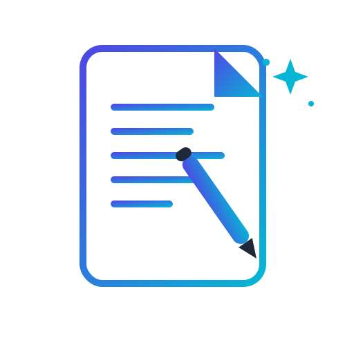

# 🤖 QuickNotes AI — Short Note Generator Pro

<p align="center">
  
</p>

<p align="center">
  <strong>Transform any topic into beautifully structured, AI-powered study notes instantly.</strong>
</p>

<p align="center">
  
  
  
</p>

---

## 🌟 Overview

**QuickNotes AI** is a modern, lightweight, and super-fast web application that condenses complex topics into crisp, structured, and export-ready educational notes. Built entirely as a client-side (Pure Frontend) application, it prioritizes user privacy, extreme security, and an exceptional UI/UX experience.

---

## ✨ Features

- **⚡ Instant AI Generation:** Leverages the power of the Google Gemini 2.5 Flash model to generate high-quality, comprehensive notes in seconds.
- **📏 Flexible Length Control:** Tailor your notes with pre-defined lengths (Short ~100 words, Medium ~250 words, Long ~500 words) or specify a strict custom word count.
- **🎨 Smart Markdown Parsing:** Automatically renders raw AI responses into beautiful typographic layouts featuring titles, headings, sub-headings, bold text, and bullet points.
- **🔒 Privacy First (BYOK):** Adheres to the "Bring Your Own Key" model. The user's API Key is securely stored directly in the browser's `localStorage`, ensuring zero server-side leaks.
- **👁️ Dynamic Eye Toggle:** Integrated with a sleek Font Awesome icon button to effortlessly show/hide the API Key for credential privacy.
- **📥 Premium Multi-Format Export:**
  - **PDF Export:** Generates clean, publication-grade PDFs with advanced emoji-stripping to guarantee compatibility without broken box characters.
  - **DOCX Export:** Exports natively to Microsoft Word files with perfect heading hierarchies and bullet layouts.
- **🕒 Smart Dynamic Filenames:** Automatically timestamps every exported document alongside your brand name (`QuickNotes_YYYY-MM-DD_HH-MM.pdf`) for optimal organization.
- **📱 100% Responsive Design:** Fully optimized glassmorphism UI engineered to look stunning across desktops, tablets, and smartphones.

---

## 🛠️ Tech Stack

- **Frontend Core:** HTML5, CSS3 (Custom Variables, Grid & Flexbox)
- **Programming Language:** Vanilla JavaScript (ES6+ Standards)
- **AI Integration:** Google Gemini AI API (`gemini-2.5-flash`)
- **Libraries & CDNs:**
  - [pdfMake](https://pdfmake.github.io/pdfmake/) — For high-performance client-side PDF compilation.
  - [docx.js](https://docx.js.org/) — For native Word Document serialization.
  - [Font Awesome 6](https://fontawesome.com/) — For premium UI/UX vector iconography.

---

## 📂 Project Structure

```text
├── index.html          # Main UI structure and DOM layout
├──  style.css       # Responsive glassmorphism styling & variables
├── app.js          # Core application orchestrator & API gateway
├── parser.js       # Markdown segmentation and JSON parser engine
├── preview.js      # Live HTML preview markdown renderer
├── pdf.js          # Client-side PDF generation module
└── docx.js         # Native DOCX generation script
```
## 📖 User Guide

### 🔑 Before You Start

QuickNotes AI follows the **BYOK (Bring Your Own Key)** approach.

For security reasons, **no API key is stored in this repository**. You must use your own Google Gemini API key.

---

## 🚀 Installation

### 1. Clone the Repository

```bash
git clone https://github.com/Shivam16a/-QuickNotes-AI-Short-Notes-Generator.git
```

### 2. Navigate to the Project

```bash
cd -QuickNotes-AI-Short-Notes-Generator
```

### 3. Open the Project

Simply open `index.html` in your browser.

Or use VS Code Live Server for the best experience.

---

# 🔑 Get Your Free Gemini API Key

1. Visit **Google AI Studio**

   * https://aistudio.google.com/

2. Sign in with your Google account.

3. Click **Get API Key**.

4. Create a new API Key.

5. Copy your API key.

---

# ⚙️ First-Time Setup

When you open QuickNotes AI for the first time:

1. Paste your Gemini API Key into the **API Key** field.

2. Click **Save API Key**.

3. The key is securely stored in your browser using **localStorage**.

4. It never gets uploaded to GitHub or stored on any external server.

> **Note:** If you clear your browser data or switch to another browser/device, you'll need to enter the API key again.

---

# ✍️ How to Generate Notes

1. Enter any topic.

Example:

```
Machine Learning
```

or

```
Explain Operating System Scheduling
```

or

```
Short Notes on Database Management System
```

2. Select the desired note length.

* Short (~100 words)
* Medium (~250 words)
* Long (~500 words)
* Custom Word Count

3. Click **Generate Notes**.

4. Wait a few seconds while Gemini AI creates structured notes.

---

# 📄 Export Options

After generating notes, you can:

* 👁️ View formatted notes
* 📋 Copy notes to clipboard
* 📄 Download as PDF
* 📝 Download as DOCX

Exported files automatically include:

* Structured headings
* Bullet points
* Clean formatting
* Timestamped filenames
* QuickNotes branding

---

# 🔒 Privacy & Security

QuickNotes AI is a **client-side application**.

This means:

* ✅ Your API key stays inside your browser.
* ✅ No backend server stores your data.
* ✅ Notes are generated directly using Google's Gemini API.
* ✅ Nothing is uploaded to this repository.

---

# ⚠️ Important Notes

* Never share your Gemini API Key publicly.
* Never commit your API Key to GitHub.
* If your key is accidentally exposed, revoke it immediately and generate a new one.

---

# 🧹 Troubleshooting

### "Invalid API Key"

* Verify that your Gemini API key is correct.
* Make sure the key is active.

---

### Notes are not generating

* Check your internet connection.
* Verify the API key.
* Ensure your Gemini API quota has not been exceeded.

---

### PDF or DOCX download isn't working

* Make sure JavaScript is enabled.
* Use the latest version of Chrome, Edge, or Firefox.
* Refresh the page and try again.

---

# 💡 Tips

* Use specific topics for better AI output.
* Custom word counts between **150–500 words** generally produce the best results.
* Download your notes as PDF for sharing or DOCX for further editing.

---

# 🤝 Contributing

Contributions are welcome!

If you'd like to improve QuickNotes AI:

1. Fork this repository.
2. Create a new feature branch.
3. Commit your changes.
4. Push the branch.
5. Open a Pull Request.

---

# ⭐ Support

If you found this project useful:

* ⭐ Star this repository
* 🍴 Fork it
* 🛠️ Contribute improvements
* 🐞 Report bugs by opening an Issue

Your support helps make QuickNotes AI even better.
